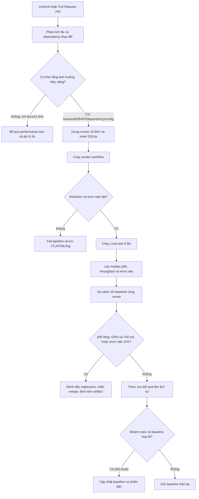

# Đề xuất Continuous Performance Testing cho EShop

## 1. Mục tiêu

Pipeline theo dõi thay đổi của EShop, chỉ chạy kiểm thử hiệu năng khi thay đổi có khả năng ảnh hưởng backend, so sánh p95 với baseline đáng tin cậy và cảnh báo hồi quy trước khi merge hoặc phát hành.

## 2. Luồng đề xuất

## 3. Chính sách quyết định chạy

### Chạy trên Pull Request

Chạy smoke và Load test khi thay đổi một trong các vùng:

- `backend/**`;
- schema, migration hoặc seed database;
- `package.json` hoặc lock file của backend;
- middleware xác thực;
- truy vấn sản phẩm, giỏ hàng, checkout hoặc đơn hàng;
- cấu hình runtime, connection hoặc cache;
- test plan, CSV hoặc script đo hiệu năng.

Có thể bỏ qua khi chỉ thay đổi tài liệu, ảnh tĩnh hoặc nội dung không được backend phục vụ. Pipeline vẫn phải ghi rõ lý do bỏ qua để quyết định có thể kiểm toán.

### Chạy theo lịch

- Mỗi đêm: Load test đầy đủ nhằm phát hiện biến động ngoài thay đổi code trực tiếp.
- Mỗi tuần hoặc trước release: Stress và Spike.
- Trước release lớn: Soak 15 phút hoặc lâu hơn trên runner dành riêng.

## 4. Quy tắc phát hiện hồi quy

Không kết luận từ một lần chạy duy nhất. Mỗi commit ứng viên chạy Load ba lần trên cùng loại runner; dùng median của ba p95.

Đánh dấu regression khi có ít nhất một điều kiện:

1. p95 của endpoint hoặc E2E tăng hơn 20% so với baseline **và** chênh lệch tuyệt đối lớn hơn 50 ms;
2. error rate từ 1% trở lên;
3. throughput giảm hơn 15% trong cùng workload;
4. backend memory tiếp tục tăng và không trở về vùng ổn định sau tải;
5. bất kỳ assertion nghiệp vụ nào thất bại.

Điều kiện kép cho p95 tránh cảnh báo vô nghĩa, chẳng hạn tăng từ 2 ms lên 3 ms là 50% nhưng chỉ lệch 1 ms.

## 5. Quản lý baseline

- Lưu baseline dưới dạng JSON/CSV có commit SHA, ngày chạy, cấu hình workload, phiên bản SUT và runner ID.
- Chỉ cập nhật baseline từ nhánh `main` sau khi kết quả đã được duyệt.
- Không tự động ghi đè baseline bằng một commit đang bị cảnh báo.
- Giữ nhiều phiên bản baseline để nhận ra suy giảm từ từ qua nhiều commit.
- Không so sánh trực tiếp kết quả từ máy có CPU/RAM khác nhau.

## 6. Artifact bắt buộc của pipeline

- Raw JTL đầy đủ;
- HTML dashboard;
- JMeter log;
- Bảng p50/p90/p95/p99, throughput và error rate theo label;
- CSV tài nguyên backend;
- metadata của runner và commit;
- kết luận pass/regression cùng ngưỡng đã dùng.

## 7. Kiểm soát cảnh báo giả

Nguồn nhiễu chính gồm tiến trình nền trên runner, warm-up JIT, antivirus, biến động ổ đĩa, dữ liệu SQLite khác nhau và JMeter chạy cùng máy với SUT.

Biện pháp:

- Dùng self-hosted runner cố định và giới hạn tác vụ chạy đồng thời;
- reset cùng một database seed trước mỗi lần;
- có warm-up ngắn nhưng không đưa warm-up vào JTL chính;
- chạy ba lần và dùng median;
- yêu cầu cả ngưỡng tương đối lẫn tuyệt đối;
- đánh dấu kết quả inconclusive và chạy lại một lần khi chỉ một chỉ số vượt biên nhẹ;
- theo dõi tài nguyên của cả SUT và máy tạo tải để phân biệt server bottleneck với load-generator bottleneck.

## 8. Trade-off

| Lựa chọn | Lợi ích | Chi phí/rủi ro |
|---|---|---|
| Test mọi commit | Phát hiện sớm nhất | Tốn thời gian và tài nguyên; dễ tạo hàng đợi CI |
| Path-based selection | Giảm chi phí đáng kể | Có thể bỏ sót thay đổi gián tiếp ảnh hưởng hiệu năng |
| Runner dùng chung | Rẻ và dễ vận hành | Nhiễu cao, baseline kém tin cậy |
| Runner cố định | So sánh ổn định hơn | Tốn chi phí duy trì và có giới hạn công suất |
| Ba lần chạy/commit | Giảm nhiễu và false alarm | Thời gian pipeline gần gấp ba |
| Chặn merge theo p95 | Ngăn regression đi vào main | Có thể làm chậm nhóm khi baseline hoặc ngưỡng sai |
| Stress/Soak theo lịch | Giảm thời gian PR | Phát hiện vấn đề tải cực hạn muộn hơn |

## 9. Kết luận

Mô hình phù hợp nhất cho EShop là chiến lược hai tầng: smoke + Load có chọn lọc trên Pull Request, còn Stress/Spike/Soak chạy định kỳ hoặc trước release. Baseline phải gắn với runner cố định và không được cập nhật tự động từ kết quả regression. Cách này cân bằng khả năng phát hiện sớm với chi phí và nguy cơ cảnh báo giả.
